**NASIL YAPTIM**

**Dr. Hayati TAŞTAN**

**LAB 3 uygulamalarını on-line yapmak:**

<https://hub.gke2.mybinder.org/user/geo-python-site-f2u176dy/lab/tree/source/notebooks/L3/conditional-statements.ipynb>
adresine git. **conditional-statements.ipynb** dosyasına çift tıkla:

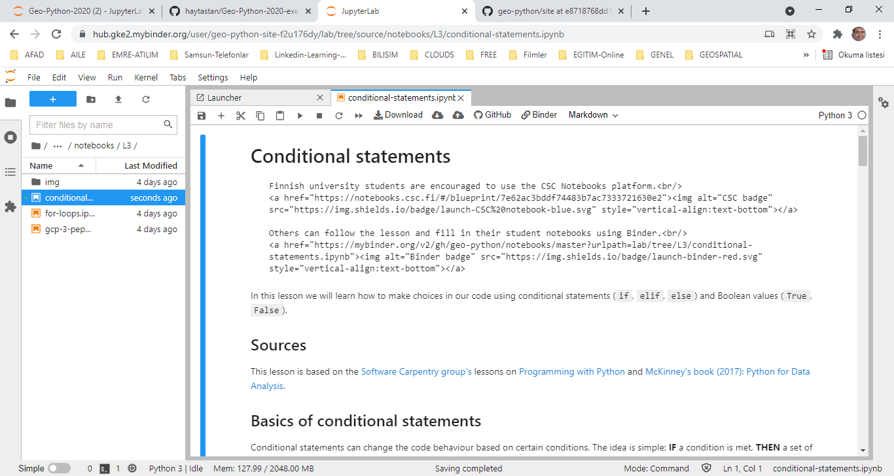{width="5.392014435695538in"
height="2.873499562554681in"}

Sayfadaki kutular üzerine gelip SHIFT+ENTER basarak kutu içindeki python
komutlarını çalıştır.

**LAB 3 uygulamalarını off-line yapmak:**

Üstteki download ile **conditional-statements.ipynb** isimli jupyter
projesini yerel diske indir ve Lesson 3.2 içine aktar:

{width="4.282638888888889in"
height="1.6212029746281715in"}

**conditional-statements.ipynb** isimli jupyter projesini, **jupyter
lab** ortamında açalım:

QGIS Shell

cd
G:\\python-uygulamalar\\1_geopython-autogis\\1-geo-python-2020\\ornekler\\Lesson-3.2

G:

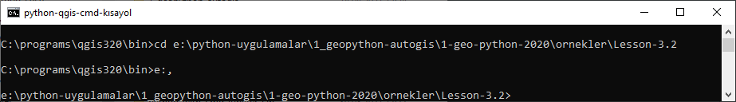{width="6.793055555555555in"
height="0.9423611111111111in"}

Jupyter lab

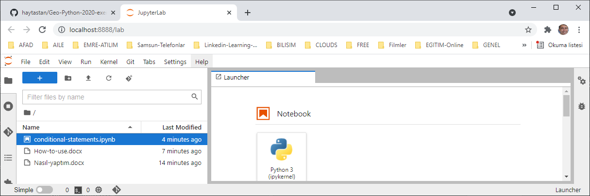{width="4.400975503062117in"
height="1.4635422134733158in"}

**conditional-statements.ipynb** isimli jupyter projesine çift
tıklayalım:

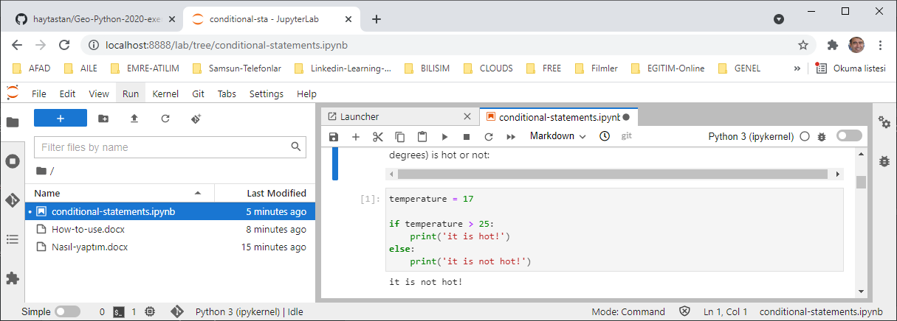{width="5.589931102362205in"
height="2.0057917760279964in"}

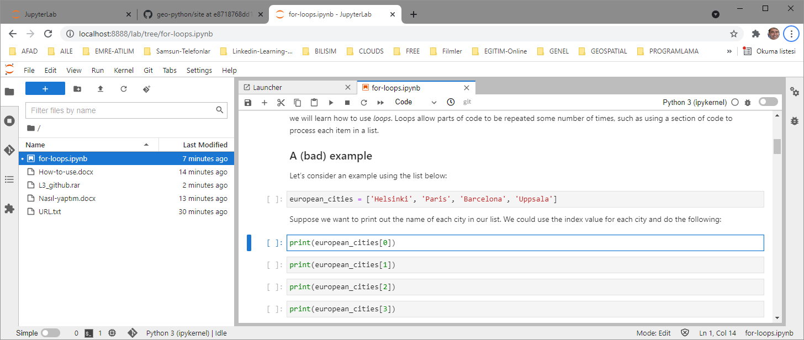{width="5.975in"
height="2.5277777777777777in"}Yukarıdaki sayfadaki kutular üzerine
gelip, SHIFT+ENTER basarak kutu içindeki python komutlarını çalıştır
(veya üstteki \> düğmesi ile çalıştır):

**Geo-Python-2020-exercise-3- solutions** isiminde açılacak github
reposuna konmak üzere

**Örnek uygulama dosyaları :**

Yukarıdaki kodları **jupyter lab** ortamında çalıştıralım:

QGIS Shell

cd
G:\\python-uygulamalar\\1_geopython-autogis\\1-geo-python-2020\\ornekler\\Lesson-3.1

G:

Jupyter lab

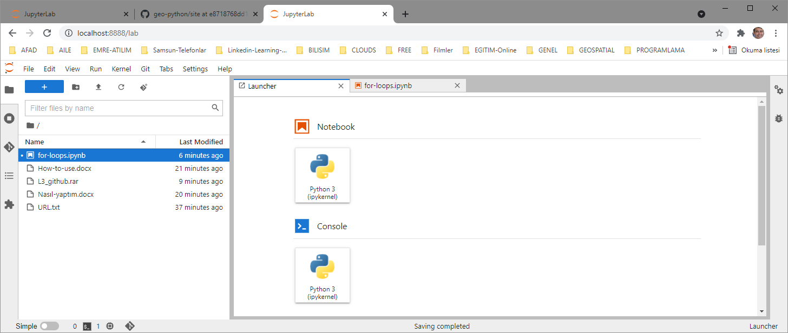{width="6.3in"
height="2.665277777777778in"}

Luncher / Python 3

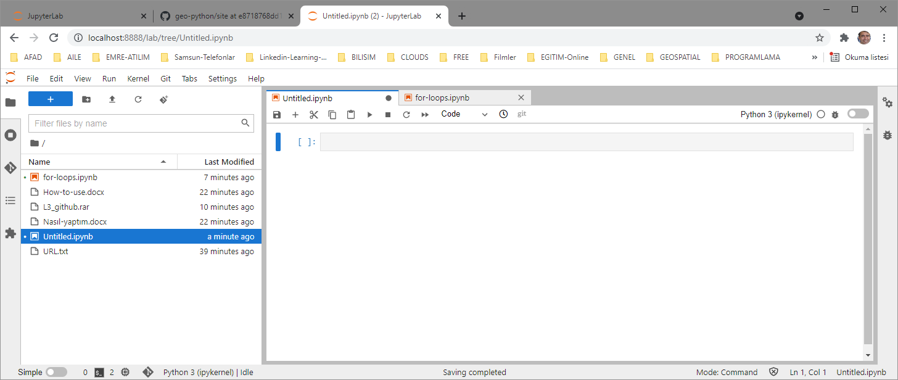{width="6.3in"
height="2.665277777777778in"}ile yeni bir jupyter projesi
(**Untitled.ipynb**) oluşturulur:

Projenin üzerine gelip sağ mouse tuşu ile **rename** yapılır:

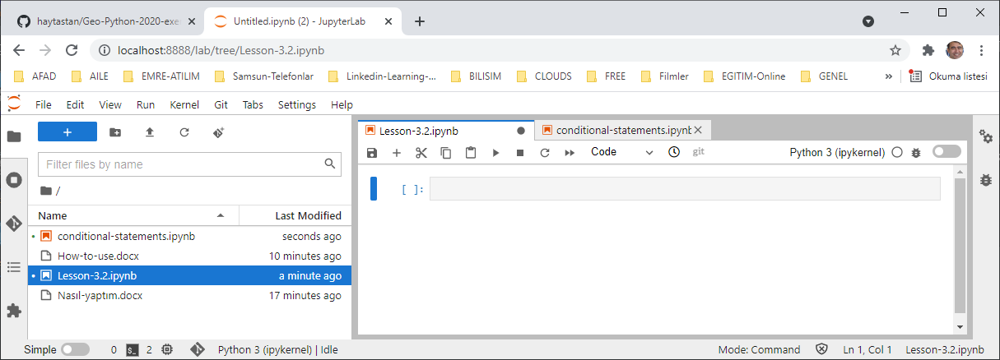{width="5.470138888888889in"
height="1.971755249343832in"}

Sol panel üzerinde iken sağ tuşla yeni bir dosya oluşturulur, ismi
**conditions.py** olarak değiştirilir:

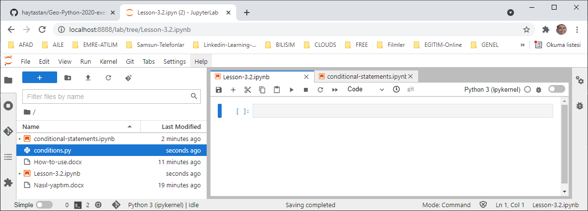{width="5.854166666666667in"
height="2.1053937007874017in"}

**conditions.py** üzerine çift tıklayılıp aşağıdaki kod bu dosya içine
yazılır ve kaydedilir (CTRL+S)

(Aşağıdaki kodlar
<http://localhost:8888/lab/tree/conditional-statements.ipynb>
projesinden alınmıştır)

\# if statement

temperature **=** **17**

**if** temperature **\>** **25:**

**print(**\'it is hot!\'**)**

**else:**

**print(**\'it is not hot!\'**)**

weather **=** \'rain\'

**if** weather **==** \'rain\'**:**

**print(**\'Wear a raincoat!\'**)**

**else:**

**print(**\'No raincoat needed.\'**)**

\# if, elif and else

**if** temperature **\>** **0:**

**print(**temperature**,** \'degrees celsius is above freezing\'**)**

**elif** temperature **==** **0:**

**print(**temperature**,** \'degrees celsius is at the freezing
point\'**)**

**else:**

**print(**temperature**,** \'degrees celsius is below freezing\'**)**

temperature **=** **-3**

**if** temperature **\>** **0:**

**print(**temperature**,** \'degrees celsius is above freezing\'**)**

**elif** temperature **==** **0:**

**print(**temperature**,** \'degrees celsius is at the freezing
point\'**)**

**else:**

**print(**temperature**,** \'degrees celsius is below freezing\'**)**

yesterday **=** **14**

today **=** **10**

tomorrow **=** **13**

**if** yesterday **\<=** today**:**

**print(**\'A\'**)**

**elif** today **!=** tomorrow**:**

**print(**\'B\'**)**

**elif** yesterday **\>** tomorrow**:**

**print(**\'C\'**)**

**elif** today **==** today**:**

**print(**\'D\'**)**

#Combining conditions

**if** **(1** **\>** **0)** **and** **(-1** **\>** **0):**

**print(**\'Both parts are true\'**)**

**else:**

**print(**\'At least one part is not true\'**)**

**if** **(1** **\<** **0)** **or** **(-1** **\<** **0):**

**print(**\'At least one test is true\'**)**

weather **=** \'rain\'

wind_speed **=** **9**

\# If it is windy or raining, print \"stay at home\", else print \"go
out and enjoy the weather!\"

**if** **(**weather **==** \'rain\'**)** **or** **(**wind_speed **\>=**
**8):**

**print(**\'Just stay at home\'**)**

**else:**

**print(**\'Go out and enjoy the weather! :)\'**)**

#Combining for-loops and conditional statements

temperatures **=** **\[0,** **12,** **17,** **28,** **30\]**

\# For each temperature, if the temperature is greater than 25, print
\"..is hot\"

**for** temperature **in** temperatures**:**

**if** temperature **\>** **25:**

**print(**temperature**,** \'is hot\'**)**

**else:**

**print(**temperature**,** \'is not hot\'**)**

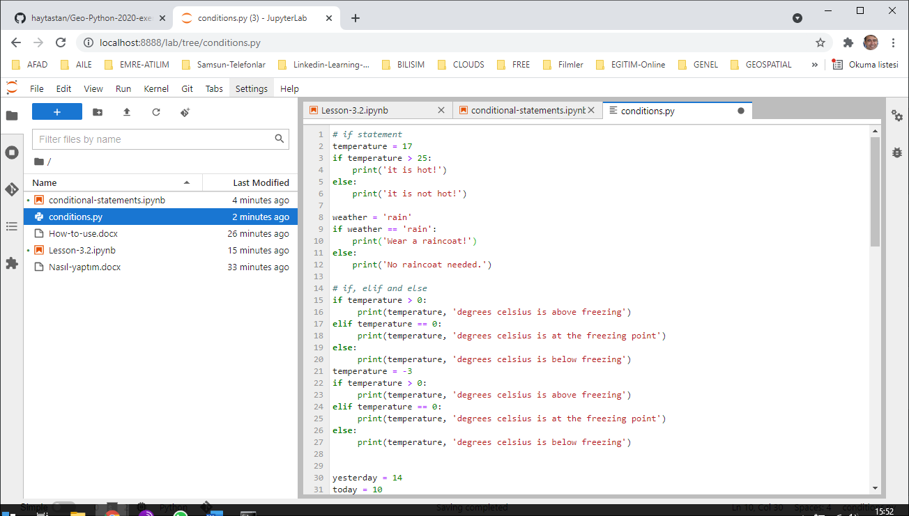{width="5.810574146981628in"
height="3.3020833333333335in"}

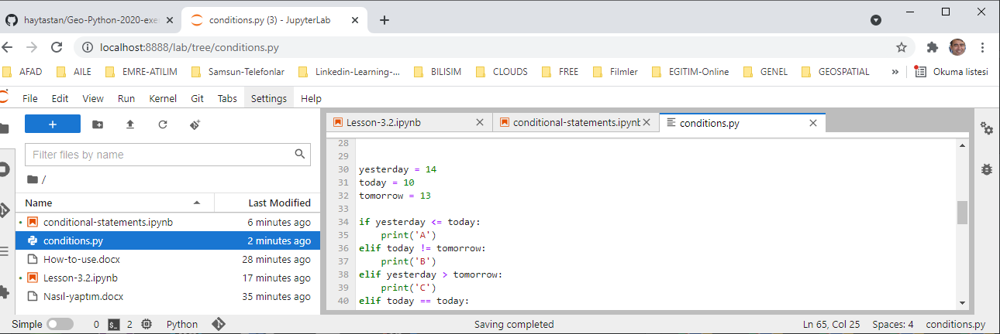{width="5.810416666666667in"
height="1.9459131671041119in"}

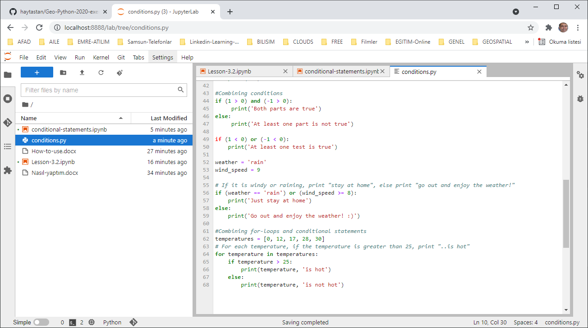{width="5.901041119860017in"
height="3.2943755468066493in"}

**Lesson-3.2.ipynb** proje dosyasına çift tıklatılır ve açılan kutu
içine aşağıdaki komut yazılır:

**run loop.py**

ve imleç kutu içinde iken **SHIFT+ENTER** tuşlarına basılara komut
çalıştırılır:

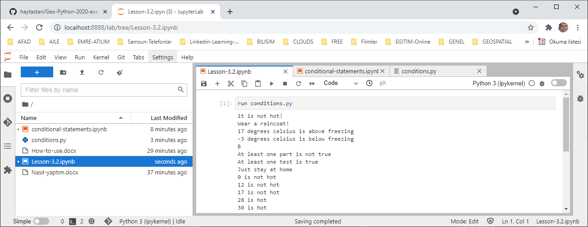{width="6.793055555555555in"
height="2.6305555555555555in"}

**conditions.py dosyasını github'a aktarma:**

Github ortamından **Geo-Python-2020-exercise-3-solutions** isimli repo
clone edilir:

(user: mygmail, pass: Çocuklar+1962)

Repo clone edilir (Git Colne a repository)

Adres olarak:
<https://github.com/haytastan/Geo-Python-2020-exercise-3-solutions>

**conditions.py** dosyası Geo-Python-2020-exercise-3-solutions isimli
yerel repo içine kopyalanır.

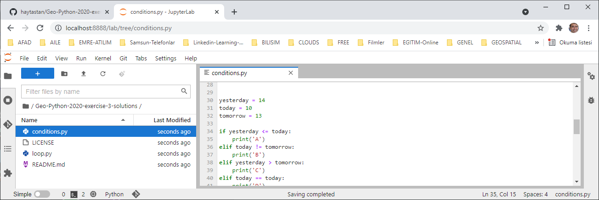{width="5.005207786526684in"
height="1.6772714348206474in"}

Sol panodaki **Git** ikonuna tıklanıp**, conditions.py** seçilip,
dosyanın sağındaki **+** işareti (Track this file) tıklanır, dosya
olduğu doğrudan "staged" area içine aktarılır.

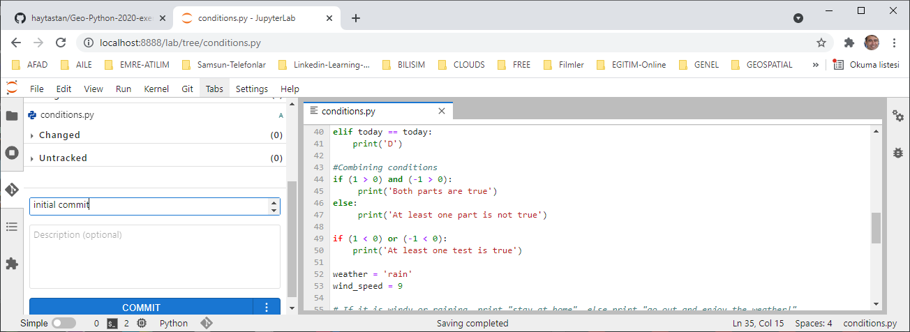{width="4.203124453193351in"
height="1.5343853893263342in"}

Aşağıdaki **summary kutusu içine** initial commit yazılır. Ve en alttaki
**COMMIT** düğmesine tıklanarak değişiklikler, dosya push için hazır
hale getirilir:

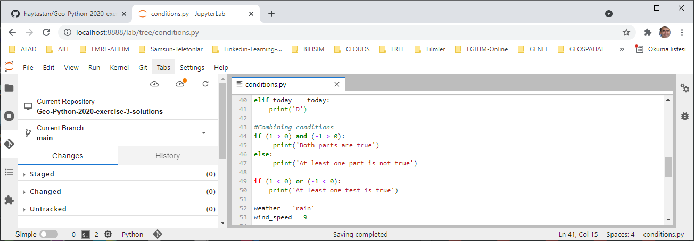{width="5.839931102362205in"
height="2.037587489063867in"}

Üstteki **Git/Push to remote** menüsü ile **stage area**'daki
değişiklikler uzaktaki **github** reposuna gönderilir:

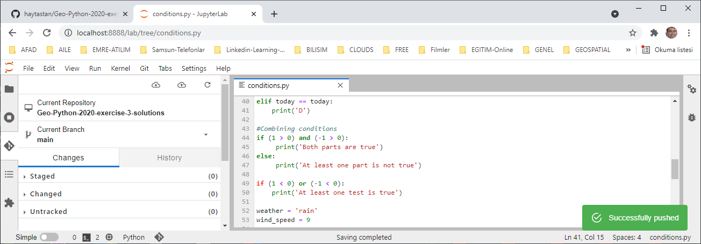{width="5.813888888888889in"
height="2.0285017497812774in"}

Github reposunda, **conditions.py** görülür:

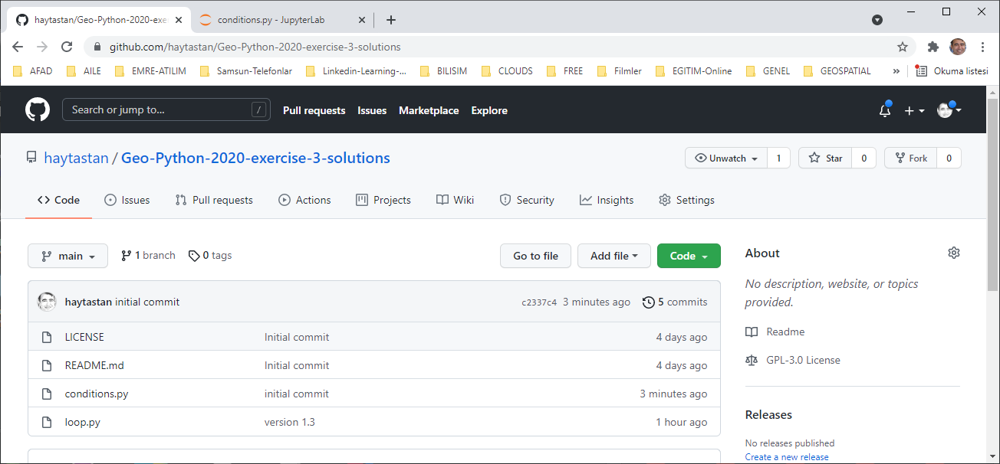{width="6.793055555555555in"
height="3.1569444444444446in"}
