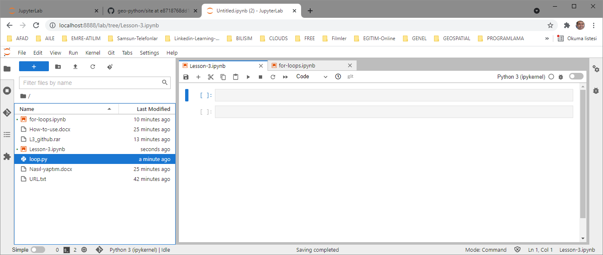

**LAB 3 uygulamalarını on-line yapmak:**

<https://hub.gke2.mybinder.org/user/geo-python-site-1lvfkgkl/lab/tree/source/notebooks/L3/for-loops.ipynb>

{width="6.3in"
height="3.7111111111111112in"}adresine git. **For-loop.ipynb** dosyasına
çift tıkla:

Sayfadaki kutular üzerine gelip SHIFT+ENTER basarak kutu içindeki python
komutlarını çalıştır.

**LAB 3 uygulamalarını off-line yapmak:**

{width="6.0in"
height="2.8472222222222223in"}Üstteki download ile **for-loop.ipynb**
isimli jupyter projesini yerel diske indir.

**for-loop.ipynb** isimli jupyter projesini, **jupyter lab** ortamında
açalım:

QGIS Shell

cd
G:\\python-uygulamalar\\1_geopython-autogis\\1-geo-python-2020\\ornekler\\Lesson-3.1

G:

Jupyter lab

{width="5.975in"
height="2.5277777777777777in"}{width="6.3in"
height="0.9784722222222222in"}

{width="5.907638888888889in"
height="2.4993055555555554in"}Yukarıdaki sayfadaki kutular üzerine
gelip, SHIFT+ENTER basarak kutu içindeki python komutlarını çalıştır
(veya üstteki \> düğmesi ile çalıştır):

**Geo-Python-2020-exercise-3- solutions** isiminde açılacak github
reposuna konmak üzere

**Örnek uygulama dosyaları :**

Yukarıdaki kodları **jupyter lab** ortamında çalıştıralım:

QGIS Shell

cd
G:\\python-uygulamalar\\1_geopython-autogis\\1-geo-python-2020\\ornekler\\Lesson-3.1

G:

Jupyter lab

{width="6.3in"
height="2.665277777777778in"}

Luncher / Python 3

{width="6.3in"
height="2.665277777777778in"}ile yeni bir jupyter projesi
(**Untitled.ipynb**) oluşturulur:

Projenin üzerine gelip sağ mouse tuşu ile **rename** yapılır:

{width="6.3in"
height="2.665277777777778in"}

Sol panel üzerinde iken sağ tuşla yeni bir dosya oluşturulur, ismi
**loop.py** olarak değiştirilir:

{width="6.3in"
height="2.665277777777778in"}

**Loop.py** üzerine çift tıklayılıp aşağıdaki kod bu dosya içine yazılır
ve kaydedilir (CTRL+S)

\# Dr. Hayati TAŞTAN

\# 30.08.2021

\# xxxxxxxxx

\# =================

#Introducing the for loop

european_cities **=** **\[**\'Amsterdam\'**,** \'Brussels\'**,**
\'Lisbon\'**,** \'Reykjavik\'**\]**

**for** city **in** european_cities**:**

**print(**city**)**

**print(**\'\-\-\-\-\-\-\-\-\-\-\-\-\-\-\-\-\-\-\--\'**)**

#for loops and the range() function

**for** i **in** range**(2,9,3):**

**print(**i**)**

**print(**\'\-\-\-\-\-\-\-\-\-\-\-\-\-\-\-\-\-\-\--\'**)**

\# Looping over the length of lists using index values

numbers **=** **\[5,** **6,** **7\]**

**for** i **in** range**(**len**(**numbers**)):**

**print(**\'Value of i:\'**,** i**)**

**print(**\'Value of numbers\[i\] before addition:\'**,**
numbers**\[**i**\])**

numbers**\[**i**\]** **=** numbers**\[**i**\]** **+** i

**print(**\'Value of numbers\[i\] after addition:\'**,**
numbers**\[**i**\])**

**print(**\'\'**)**

**print(**numbers**)**

**print(**\'\-\-\-\-\-\-\-\-\-\-\-\-\-\-\-\-\-\-\--\'**)**

cities **=** **\[**\'Helsinki\'**,** \'Stockholm\'**,** \'Oslo\'**,**
\'Reykjavik\'**,** \'Copenhagen\'**\]**

countries **=** **\[**\'Finland\'**,** \'Sweden\'**,** \'Norway\'**,**
\'Iceland\'**,** \'Denmark\'**\]**

**for** i **in** range**(**len**(**cities**)):**

**print(**cities**\[**i**\],** \'is the capital of\'**,**
countries**\[**i**\])**

**print(**\'\-\-\-\-\-\-\-\-\-\-\-\-\-\-\-\-\-\-\--\'**)**

odd_numbers **=** **\[1,** **3,** **5\]**

even_numbers **=** **\[2,** **4,** **6\]**

**for** i **in** range**(**len**(**odd_numbers**)):**

**print(**odd_numbers**\[**i**\]** **+** even_numbers**\[**i**\])**

{width="6.793055555555555in"
height="4.45625in"}

**Lesson-3.ipynb** proje dosyasına çift tıklatılır ve açılan kutu içine
aşağıdaki komut yazılır:

**run loop.py**

{width="6.793055555555555in"
height="4.45625in"}ve imleç kutu içinde iken **SHIFT+ENTER** tuşlarına
basılara komut çalıştırılır:

**Loop.py dosyasını github'a aktarma:**

Github ortamında **Geo-Python-2020-exercise-3-solutions** isimli boş bir
repo oluşturulur:

(user: mygmail, pass: Çocuklar+1962)

Repo clone edilir (Git Colne a repository)

Adres olarak:
<https://github.com/haytastan/Geo-Python-2020-exercise-3-solutions>

Loop.py dosyası Geo-Python-2020-exercise-3-solutions isimli yerel repo
içine kopyalanır.

Sol panodaki **Git** ikonuna tıklanıp**, lopp.py** seçilip, aşağıdaki
**summary kutusu içine** initial commit yazılır. Ve en alttaki
**COMMIT** düğmesine tıklanarak değişiklikler, yereldeki **stage area**
bölümüne aktarılır

Üstteki **Git/Push to remote** menüsü ile **stage area**'daki
değişiklikler uzaktaki **github** reposuna gönderilir.

{width="6.793055555555555in"
height="3.404166666666667in"}Github reposunda, **loop.py** görülür:
